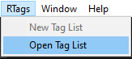

# Enhanced Unity Tags
This tool aims to provide a more capable tagging system for unity. It provides the ability to have pre cached tags, and multiple tags per gameobject or even component.

## **Contents**
- [How To Use (In Engine)](#how-to-use-unity)
- [How To Use (In Code)](#how-to-use-code)
- [License](#license-info)

<a name = "how-to-use-unity">

## How To Use (Editor)

### Setup
- Add the UnityPackage file to your project

- The first step is to create a tag list


- Then open the tag list and add any tags you plan on using




Once that is done you are free to use the tags anywhere

### Adding tags to GameObject(s)
- Right click on the GameObject(s) in the hierarchy and select add tag


- In the popup select the tag you want to add


### Adding tags to Compoent
- Right click on the Compoent in the inspector and select add tag


- In the popup select the tag you want to add


### Adding and removing tags via the ObjectTags component

- The ObjectTags componet has add and remove buttons for the GameObject and for each component


</a>

<a name = "how-to-use-code">

### How To Use (Code):

```csharp
//All important methods and classes are avalible in the RTags namspace so make sure to add the using statement when you want to use it
using RTags; 
```

```csharp
//The following is how to check, add and remove tags from GameObjects and Components

//Check if the target is tagged
gameObject.IsTagged(tagName);
component.IsTagged(tagName);

//Returns an array of all assigned tags
gameObject.GetAssignedTags();
component.GetAssignedTags();

//Adds the tag to the target
gameObject.AddTag(tagName);
component.AddTag(tagName);

//Removes the tag from the target
gameObject.RemoveTag(tagName);
component.RemoveTag(tagName);
```
</a>


<a name = "license-info">

## License Info:
This project is licensed under the terms of the MIT license.

</a>
